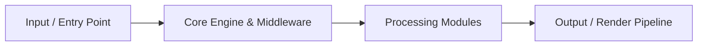

<div align="center">

# ⚡ Enterprise-Email-Management-Platform

> **A modern email-oriented platform designed around digital communication, message management, user workflows, and extensible communication infrastructure**

   

</div>

---


## 📖 Table of Contents

- [Overview](#-overview)
- [Architecture & Workflow](#-architecture--workflow)
- [Features](#-features)
- [Tech Stack](#-tech-stack)
- [Quick Start & Installation](#-quick-start--installation)
- [Environment Variables](#-environment-variables)
- [Project Structure](#-project-structure)
- [Scripts & Commands](#-scripts--commands)
- [Contributing](#-contributing)
- [License](#-license)


## 🚀 Overview

**Enterprise-Email-Management-Platform** is an engineered solution built with PHP, JavaScript.

- **Repository**: [`linuxsujith-lab/Enterprise-Email-Management-Platform`](https://github.com/linuxsujith-lab/Enterprise-Email-Management-Platform)
- **Default Branch**: `main`
- **Primary Runtime**: PHP (91.6%), JavaScript (8.4%)


## 🏗️ Architecture & Workflow




## ✨ Key Features

- ⚡ **High Performance Architecture**: Optimized execution lifecycle built on PHP.
- 🛡️ **Ground-Truth Data Integrity**: Built with resilient state validation and type-safe interfaces.
- 🧩 **Modular Subsystem Design**: Clean decoupling of UI components, service abstractions, and data transformations.
- 🎨 **Responsive & Intuitive Interface**: Engineered for frictionless user experience across desktop and mobile.
- 🚀 **Zero-Config Deployment Ready**: Pre-configured build scripts and modern containerization support.


## 💻 Tech Stack

| Technology | Category | Role |
| :--- | :--- | :--- |
| **PHP** | `other` | Core application framework & tooling |
| **JavaScript** | `other` | Core application framework & tooling |


## ⚡ Quick Start & Installation

### Prerequisites

Ensure you have the verified runtime installed on your machine:
- **NPM** (v18+ or compatible runtime)
- **Git**

### Step-by-Step Setup

1. **Clone the repository:**
   ```bash
   git clone https://github.com/linuxsujith-lab/Enterprise-Email-Management-Platform.git
   cd Enterprise-Email-Management-Platform
   ```

2. **Install dependencies:**
   ```bash
   npm install
   ```

3. **Configure environment variables:**
   ```bash
   cp .env.example .env
   # Populate your secrets and keys in .env
   ```

4. **Launch development server:**
   ```bash
   npm run dev
   ```


## 📂 Project Structure

```plaintext
.
├── CHANGELOG.md
├── README.md
├── UPGRADE.md
├── VERSION
├── artisan
├── autoload.php
├── bootstrap
│   ├── app.php
│   ├── autoload.php
│   └── cache
│       ├── config.php
│       ├── packages.php
│       └── services.php
├── composer.json
├── composer.lock
├── guideline
│   ├── 404.html
│   ├── __init__.py
│   ├── api
│   │   └── index.html
│   ├── base.html
│   ├── content.html
│   ├── css
│   │   ├── base.css
│   │   ├── bootstrap-custom.min.css
│   │   ├── extra.css
│   │   ├── font-awesome-4.5.0.css
│   │   └── highlight.css
│   ├── fonts
│   │   ├── fontawesome-webfont.eot
│   │   ├── fontawesome-webfont.svg
│   │   ├── fontawesome-webfont.ttf
│   │   └── fontawesome-webfont.woff
│   ├── img
│   │   ├── favicon.ico
│   │   └── grid.png
│   ├── index.html
│   ├── js
│   │   ├── base.js
│   │   ├── bootstrap-3.0.3.min.js
│   │   ├── highlight.pack.js
│   │   └── jquery-1.10.2.min.js
│   ├── mkdocs
│   │   ├── js
```


## 📜 Verified Available Scripts

The following scripts are defined in the repository package manifest:

| Command | Script Name | Action / Script Target |
| :--- | :--- | :--- |
| `npm run prod` | `prod` | `gulp --production` |
| `npm run dev` | `dev` | `gulp watch` |


## 🤝 Contributing

Contributions, issues, and feature requests are welcome!

1. Fork the Project
2. Create your Feature Branch (`git checkout -b feature/AmazingFeature`)
3. Commit your Changes (`git commit -m 'feat: add amazing feature'`)
4. Push to the Branch (`git push origin feature/AmazingFeature`)
5. Open a Pull Request


## 📄 License

Distributed under the **MIT License**. See `LICENSE` for more information.

---

<div align="center">
  <sub>Engineered with precision by <a href="https://github.com/linuxsujith-lab/Enterprise-Email-Management-Platform">linuxsujith-lab/Enterprise-Email-Management-Platform</a></sub>
</div>
